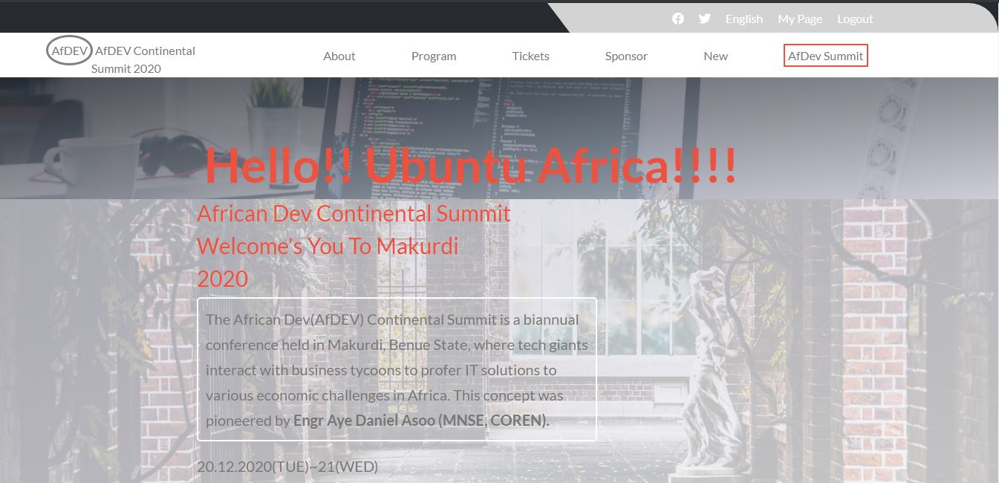

# AfDev Continental Summit Africa
Capstone Project by [Microverse]
This HTML & CSS Capstone Project is an online fictitious Developer website called AfDev Continental Summit (2020). It's a curated event jam-packed with inspiration and stimulation for software professionals and business tycoons. This event brings the brightest minds in the industry assemble every year in Makurdi, Benue State, to examine the changing role of software programmers, engineers, developers, managers, and architects. These professionals explore crucial technologies, cutting-edge techniques, and provide essential professional training and how the training would impact development in Africa across various sectors.


 
## Built With

- HTML5
- CSS3
      [Flex]
      [Grid]

[LIVE DEMO LINK](https://rawcdn.githack.com/Alaska01/Capstone-AfDev-Summit/8e0de9b9724dbf888335d37cdfb72f0a23e20aec/index.html)

[LIVE DEMO LINK CAPSTONE VIDEO PRESENTATION](https://www.loom.com/share/3184674af9ff471e8e5b79d5da52da35)

## Work Done 🔧

- Use semantic HTML tags.
- Use CSS selectors correctly.
- Use HTML elements box model (margin, padding, width, height).
- Use industry-standard tools (flexbox) to place elements in the page.
- Ability to create UIs adaptable to different screen sizes using mediaqueries.
- Apply front-end best practices.
- Ability to create UIs adjusted to given designs.
- Strong English written and verbal communication.
- Ability to communicate information effectively to technical and non-technical people.
- Ability to translate business requirements into software solutions.
- Ability to work well in a fast-paced environment under deadlines.
- Ability to perform tasks and complete projects with minimal supervision.


# Getting Started 🚀

These instructions will get you a copy of the project up and running on your local machine.

## How To Use 🔧

From your command line, first clone the project:  

```bash
# Clone this repository
$ git clone https://github.com/Alaska01/Capstone-AfDev-Summit.git

# Go into the repository
$ cd Devsummit

```

## Author
👤 **Aye Daniel A*****

- [Github](https://github.com/Alaska01)
- [Twitter](https://twitter.com/AyeAsoo)
- [Linkedin](https://www.linkedin.com/in/daniel-asoo-aye-178500140/)

## Show your support

Give a ⭐️ if you like this project!

## Acknowledgments

- I acknowledge Microverse, the global remote school for developers.
- I appreciate The Odin Project for providing the project and making lessons simple to learn.
- I appreciate Cindy Shin for providing me with the design

## 📝 License

This project is [MIT](lic.url) licensed.
